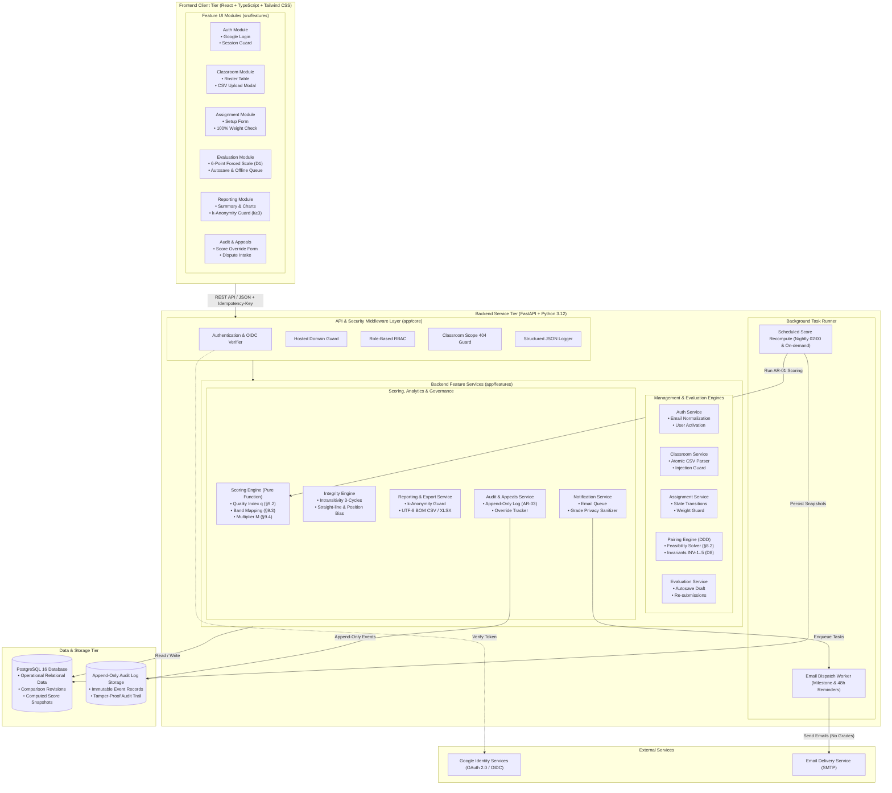

# System Architecture & Component Diagram — PairEval

## 1. Mermaid Component Diagram

---

## 2. Architectural Principles & Specifications

| Principle ID | Principle | Description & Implementation |
|---|---|---|
| **AR-01** | Pure Function Scoring Engine | `Scoring Engine` ถูกออกแบบให้เป็น Pure function คำนวณจากข้อมูลดิบในฐานข้อมูลโดยไม่มี state ภายใน เมื่อให้ข้อมูลนำเข้าชุดเดิมจะคำนวณได้ผลลัพธ์เดิมทุกหลักทศนิยม (Reproducible & Auditable) |
| **AR-02** | Unified Authorization Layer | ทุกการเข้าถึงข้อมูลที่สามารถระบุตัวตนของผู้ประเมิน (Evaluator Identity) ต้องผ่าน Middleware ตรวจสอบสิทธิ์เดียวกันอย่างเคร่งครัด โดยเฉพาะการ Mask ข้อมูลด้วย Pseudonymous ID สำหรับ Co-teacher และ Student |
| **AR-03** | Append-Only Audit Trail | ข้อมูลใน Audit Log ถูกจัดเก็บแบบ Append-only แยกส่วนจาก Operational Data ทั่วไป และไม่มีฟังก์ชันหรือ API ใดที่สามารถแก้ไขหรือลบประวัติการกระทำได้ |
| **AR-04** | Client-Side Offline Resilience | ฝั่ง Frontend Client มีระบบ Local Queue สำหรับบันทึกคำตอบระหว่างที่สัญญาณเครือข่ายขัดข้อง และจะทำการ Autosave ไปยัง Server แบบ Idempotent ทันทีที่เชื่อมต่ออินเทอร์เน็ตได้อีกครั้ง |
| **AR-05** | k-Anonymity & Privacy by Design | ข้อมูลคะแนนรายบุคคลจะไม่ถูกเปิดเผยต่อนักศึกษาจนกว่าจะมีผู้ส่งประเมิน $\ge 3$ คน ($k_{min}$) และห้ามแสดงผลต่างคะแนนรายวัน (Delta) เพื่อป้องกันการแกะรอยผู้ประเมินตามมาตรฐาน PDPA |
| **AR-06** | Mathematical Pairing Feasibility | ระบบตรวจสอบความเป็นไปได้ทางคณิตศาสตร์ระหว่าง Workload ($k$) และ Coverage ($R$) ก่อน Publish หากเกินขีดจำกัดจะปรับลด $R$ อัตโนมัติและแสดงเหตุผลเป็นตัวเลขแก่อาจารย์ |
