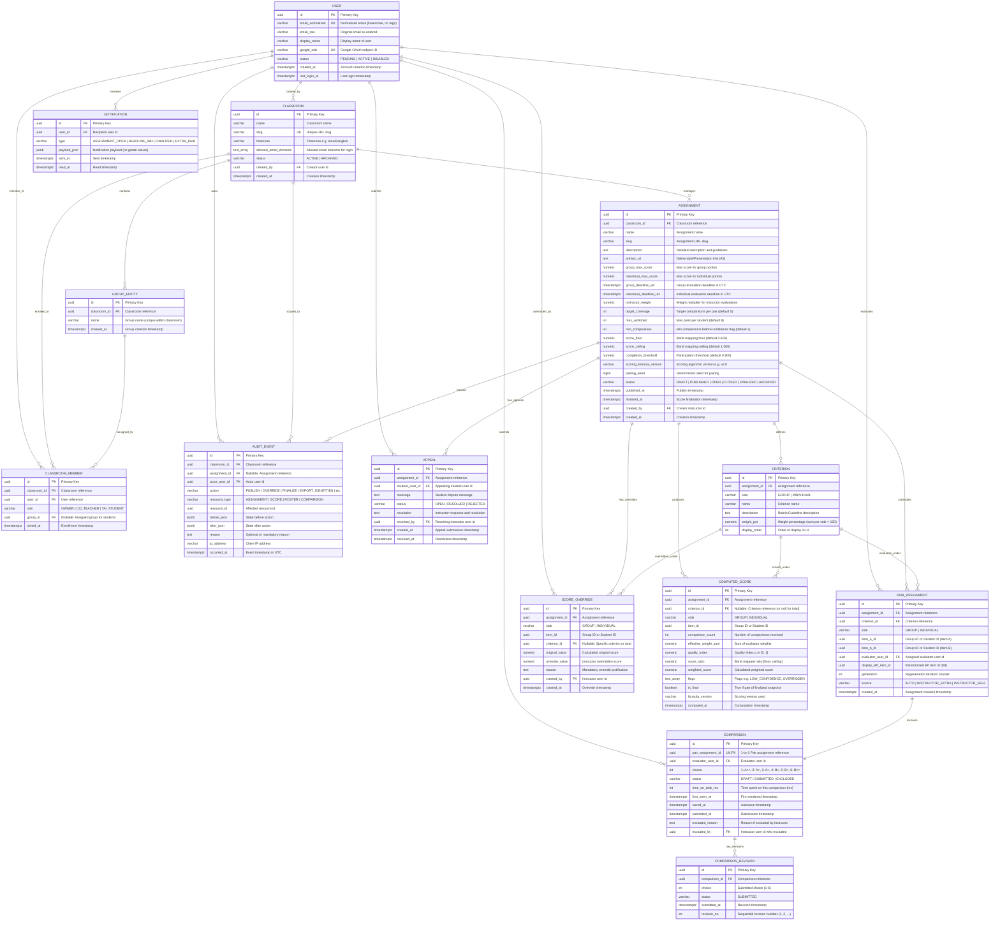

# Entity Relationship Diagram (ERD) — PairEval

## 1. Mermaid Entity Relationship Diagram

---

## 2. Database Constraints & Invariants

| ID | Constraint / Invariant | Business Rule / Requirement Traceability |
|---|---|---|
| **DR-01** | `comparison.status = 'SUBMITTED'` | เฉพาะผลการเปรียบเทียบที่กดส่ง (SUBMITTED) เท่านั้นที่จะถูกนำมาคิดใน Quality Index ($q$) และคะแนนผลลัพธ์ (FR-SCORE-01) |
| **DR-02** | `pair_assignment` Soft-delete / Generation | ไม่อนุญาตให้ลบ `pair_assignment` ที่มี `comparison` สถานะ SUBMITTED แต่ให้เพิ่ม `generation` เมื่อต้องการ Re-generate คู่ใหม่ (FR-PAIR-11) |
| **DR-03** | Immutable `computed_score` | ข้อมูลคะแนนที่ `is_final = true` เป็น Immutable ไม่สามารถแก้ไขค่าตรง ๆ ได้ หากมีการปรับคะแนนต้องบันทึกผ่านตาราง `score_override` เท่านั้น (FR-SCORE-08, FR-SCORE-09) |
| **DR-04** | Fixed-Point `numeric` Precision | คะแนน, น้ำหนัก, และสัดส่วนทั้งหมดจัดเก็บเป็นประเภท `numeric` (เช่น `numeric(8,3)`, `numeric(6,5)`) ห้ามใช้ `float`/`double` เพื่อป้องกัน Floating-point precision error ในเอกสารคะแนน |
| **DR-05** | UTC Timestamps | ทุก Timestamp ในระบบ (`created_at`, `deadlines`, `occurred_at`) จัดเก็บเป็น UTC (`TIMESTAMPTZ`) เสมอ และแปลงเป็น Timezone ของห้องเรียนเฉพาะตอนแสดงผลใน UI (FR-ASSIGN-05) |
| **DR-06** | Unique Evaluator Pair Assignment | `UNIQUE(assignment_id, criterion_id, evaluator_user_id, item_a_id, item_b_id, generation)` ป้องกันไม่ให้ Evaluator ได้รับคู่ประเมินเดิมซ้ำในเกณฑ์เดียวกัน (INV-2) |
| **DR-07** | Non-reflexive Pair Assignment | `CHECK (item_a_id <> item_b_id)` ป้องกันไม่ให้สร้างคู่เปรียบเทียบระหว่าง Item เดียวกัน (INV-1) |
| **DR-08** | Append-Only Audit Trail | ตาราง `audit_event` ต้องไม่มี API สำหรับ `UPDATE` หรือ `DELETE` เพื่อรองรับความโปร่งใสและตรวจสอบย้อนหลังได้ 100% (FR-AUDIT-03, AR-03) |
| **DR-09** | Criteria Weight Sum = 100% | ตรวจสอบ `SUM(weight_pct) = 100.00` ในแต่ละ `side` (GROUP / INDIVIDUAL) ก่อนเปลี่ยนสถานะ Assignment เป็น `PUBLISHED` (FR-ASSIGN-02) |
| **DR-10** | 6-Point Scale Boundary | `CHECK (choice BETWEEN 1 AND 6)` ในตาราง `comparison` เพื่อบังคับใช้ 6-point forced choice scale อย่างเคร่งครัด (D1, FR-EVAL-03) |
